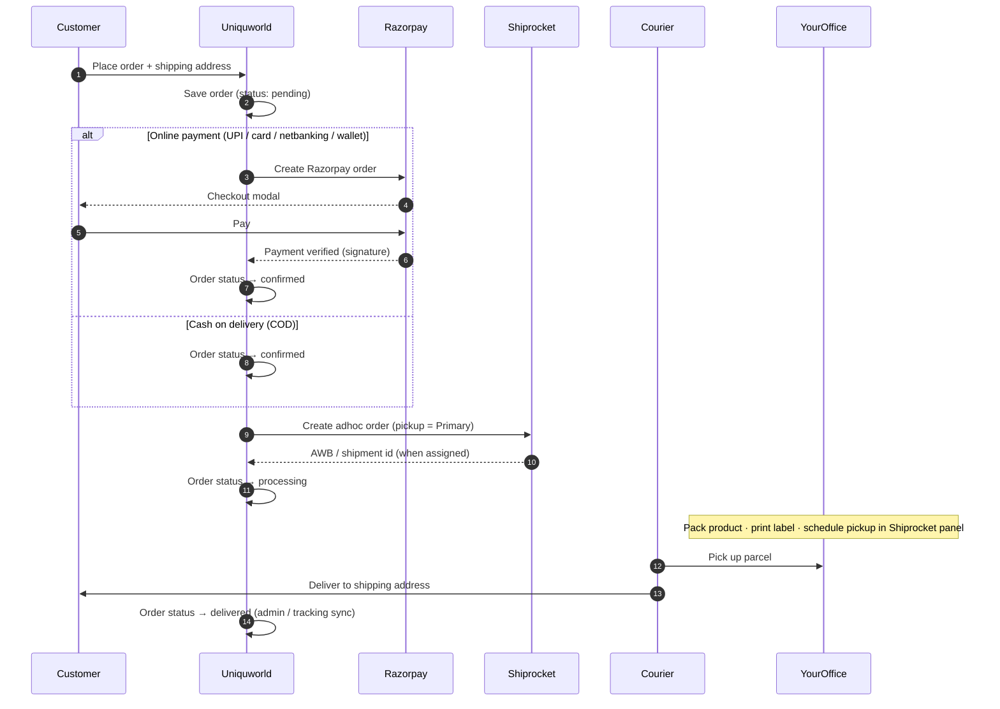

# Uniquworld — Order & Delivery Workflow

End-to-end flow from customer checkout through Razorpay payment, Shiprocket shipment, office pickup, and home delivery.

> **PDF (diagrams + timeline):** [ORDER_FULFILLMENT_WORKFLOW.pdf](./ORDER_FULFILLMENT_WORKFLOW.pdf)  
> Regenerate: `python scripts/generate_order_workflow_pdf.py`

---

## Sequence diagram



---

## Timeline

| Step | When | Who | What happens | Order status (app) | Shipment |
|------|------|-----|--------------|-------------------|----------|
| **1** | T+0 | Customer | Adds items, address, chooses payment | — | — |
| **2** | T+0 | Uniquworld API | Creates order + line items + pending payment | `pending` | — |
| **3a** | T+0–2 min | Customer + Razorpay | Pays online (UPI/card/etc.) | `pending` | — |
| **3b** | T+0 | Uniquworld API | COD: skips Razorpay | `confirmed` | — |
| **4** | After pay (3a) or immediately (3b) | Uniquworld API | Verifies payment / confirms COD | `confirmed` | — |
| **5** | After step 4 | Uniquworld API | Pushes order to Shiprocket (`pickup_location: Primary`) | `processing` | `created` |
| **6** | Same day | **Your team (office)** | Pick items, pack, weigh, print label | `processing` | — |
| **7** | Same day | **Your team** | Shiprocket panel: assign courier, schedule pickup | `processing` | AWB assigned |
| **8** | Pickup day | Courier | Collects parcel from office (`Primary` address) | `processing` | picked up |
| **9** | 2–7 days (typical) | Courier | In transit → out for delivery | `processing` | in transit |
| **10** | Delivery day | Courier + Customer | Handover at customer address | `delivered` | delivered |
| **11** | After delivery | Uniquworld | Store partner earnings credited (if store product) | `delivered` | — |

**Typical elapsed time**

| Phase | Estimate |
|-------|----------|
| Checkout + payment | 1–5 minutes |
| Pack + Shiprocket pickup schedule | Same day (your SLA) |
| Courier pickup → delivery | 2–7 days (pincode + courier) |

---

## Payment paths

### Online (Razorpay)

1. `POST /api/v1/account/orders` — place order, get Razorpay order id  
2. Customer completes Razorpay checkout in browser  
3. `POST /api/v1/account/orders/verify-payment` — verify signature  
4. Server creates Shiprocket shipment automatically  

**Code:** `server/src/services/order.service.js` → `placeOrder`, `verifyRazorpayPayment`

### Cash on delivery (COD)

1. `POST /api/v1/account/orders` with `paymentMethod: cod`  
2. Order confirmed immediately  
3. Shiprocket shipment created in same request  
4. Courier collects cash from customer on delivery  

Requires `COD_ENABLED=true` in server env.

---

## Shiprocket pickup (your office)

The API always sends pickup from the location named in env:

```env
SHIPROCKET_PICKUP_LOCATION=Primary
```

That name must match **Shiprocket → Settings → Pickup Locations** (e.g. office / warehouse address).

**What the app does automatically**

- Creates Shiprocket adhoc order with customer address + items + COD/Prepaid  
- Stores AWB, tracking URL, Shiprocket order/shipment ids when returned  

**What you do manually (Shiprocket dashboard)**

- Assign courier  
- Schedule pickup time  
- Print shipping label  
- Handle failed delivery / RTO  

**Code:** `server/src/services/shiprocket.service.js` → `createShipmentForOrder`

---

## Order & shipment statuses

### Order (`orders.status`)

| Status | Meaning |
|--------|---------|
| `pending` | Placed; awaiting online payment |
| `confirmed` | Paid (or COD accepted) |
| `processing` | Shipment created; fulfillment in progress |
| `shipped` | Handed to courier (optional admin update) |
| `delivered` | Received by customer |
| `cancelled` | Cancelled by customer or admin |

### Shipment (`shipments.shipment_status`)

Created as `created` or `pending`. Admin / Shiprocket tracking may update to `picked_up`, `in_transit`, `out_for_delivery`, `delivered`.

Customer tracking: account order detail + AWB lookup via Shiprocket.

---

## Admin alternatives

| Mode | Use when |
|------|----------|
| **Auto (Shiprocket)** | Default — API creates Shiprocket order after payment |
| **Manual delivery** | Own staff, local courier, hand delivery — admin enters AWB/courier in ERP |

**Admin API:** `POST /api/v1/erp/commerce/shipments` with `deliveryMode: auto` or `manual`

---

## Environment checklist

| Variable | Purpose |
|----------|---------|
| `RAZORPAY_KEY_ID` / `RAZORPAY_KEY_SECRET` | Online payments |
| `COD_ENABLED` | Allow cash on delivery |
| `SHIPROCKET_ENABLED=true` | Real shipments (false = mock tracking in dev) |
| `SHIPROCKET_EMAIL` / `SHIPROCKET_PASSWORD` | Shiprocket API login |
| `SHIPROCKET_PICKUP_LOCATION` | Must match pickup location **name** in Shiprocket |
| `SHIPROCKET_CHANNEL_ID` | From Shiprocket → Settings → Channels |

You can change pickup address or location name anytime in Shiprocket; update `SHIPROCKET_PICKUP_LOCATION` on Render and redeploy.

---

## Quick reference — who does what

```
Customer     → Browse, pay, receive parcel
Uniquworld   → Order, payment, Shiprocket API, notifications, tracking UI
Razorpay     → Payment gateway (online only)
Shiprocket   → Courier network, AWB, labels, tracking
Your office  → Stock, pack, schedule pickup
Courier      → Pickup from office → deliver to customer
```

---

## Related docs

- Backend architecture: `server/docs/ARCHITECTURE.md`
- Env template: `server/.env.example`
